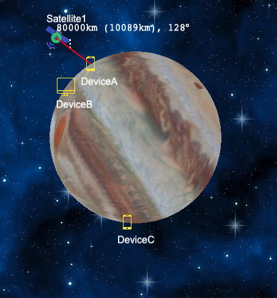
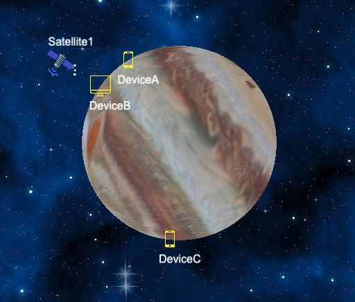
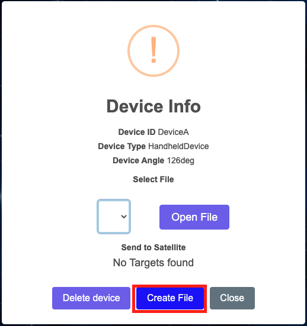
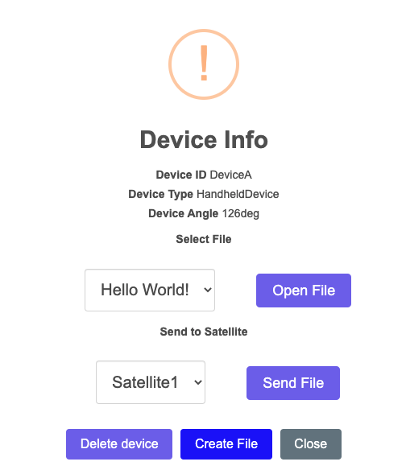
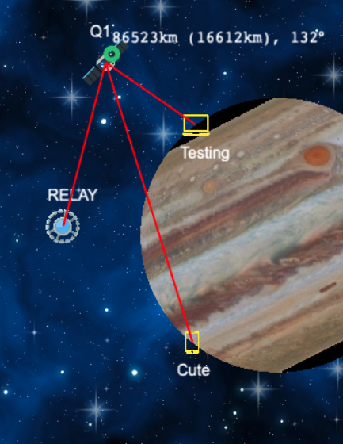

# COMP2511 Assignment: Back in Blackout

> Due: Friday, 8th of October, Week 4 at 5pm.

> Value: **15%** of course mark

## Contents

[[_TOC_]]

## 0. Change Log

- Mon 20th Sept 12-3pm.  Some minor clarifications to wording
- Mon 20th Sept 6-9pm.  Clarifications, Elephant properties were missing, all velocities set to per minute instead of per hour.
- Mon 20th Sept 12am.  Release Student Repos
- Tue 21st Sept 12pm.  Release Sample Implementation
- Tue 21st Sept 8pm.  Clarify Shrinking Satellite Behaviour
- Sat 25th Sept 4pm.  Rephrased some relay logic to make it clearer
- Sat 25th Sept 9pm.  Fixed up Simple Example since calculation result was wrong (18 + 128 != 136 it's equal to 146...)
- Sun 26th Sept 4pm. Clarified Relay behaviour with Desktops/Standard satellites (and other 'requirements')
- Tue 28th Sept 5:30am.  Clarified Shrinking Satellite
- Mon 4th Oct 4pm.  Clarified that communicable satellites includes relay satellites (and their communicable satellites)
- Wed 6th Oct 7am.  Fixed typo of 200km -> 200,000km.

## Your Private Repository

Is located at https://gitlab.cse.unsw.edu.au/COMP2511/21T3/students/z555555/assignment

<ins><b>Make sure to replace the zID in the header.</b></ins>

## Introduction Video

You can watch an introduction video here [https://thebox.unsw.edu.au/3CF51850-1B4D-11EC-9F0B728F51087198](https://thebox.unsw.edu.au/3CF51850-1B4D-11EC-9F0B728F51087198)

## 1. Aims

- Practice applying a systematic approach to object-oriented design process
- Gain experience in implementing an object-oriented program with multiple interacting classes
- Gain hands on experience with Java libraries

## 2. Preamble and Problem

So much of today's technology uses Global Positioning System (GPS) information.  For example, tagging photographs with their location, guiding drivers with car navigation systems, and even missile control systems. There are currently 31 active GPS satellites (as of the time of writing this) orbiting the Earth all together providing near-constant GPS coverage.

In the far future, society has become advanced to the point where they have begun to occupy a series of moons and asteroids around the planet Jupiter.  Individuals rely on satellites for all their communication desires.  Three major satellites exist around Jupiter.

This assessment aims to provide you with design experience for a non-trivial system.  You will be architecting and modelling how these multiple satellites will communicate and function with various devices.  The form of communication that you will be simulating is a simplified version of the modern internet, simply just file transfer.  You can either upload a file to a satellite from a device, download a file from a satellite to a device, or send a file from a satellite to a satellite.

Your solution should adopt an Object-Oriented approach that utilises concepts such as abstraction, encapsulation, composition, and inheritance, as taught in lectures.

### A simple example

Let’s assume initially there is a `Standard Satellite` at height approximately 80,000km above the centre of Jupiter and at θ = 128 degrees (anticlockwise). In addition there are 3 devices; DeviceA, DeviceB, and DeviceC.  DeviceA and DeviceC are handheld devices, whereas DeviceB is a desktop device.



In this system, the satellite can talk to device A and device A can talk to the satellite (communication is done by sending files) since they are in range of each other.  SatelliteA however cannot talk to DeviceB (and DeviceB cannot talk to SatelliteA) because `Standard Satellite`s have restrictions on what devices they can talk to (discussed in more detail later).  Finally SatelliteA cannot connect to DeviceC because it's not in visible sight range.  The red line in the image highlights this.

Devices are static and will not move, but satellites can! Satellites move based on a constant linear velocity, in this case Standard Satellites have a linear velocity of 2,500 km per minute (or 2,500,000 metres).  From this, we can calculate its angular velocity based on its height (which is the radius from the center of Jupiter).  For example, after 10 minutes it would have moved a total of `2,500 / 80,000 * 10 mins = 0.03125 * 10 = 0.3125 radians ~= 18 degrees` (note that we don't have to account for the fact they are measured in `km` here since the extra `10^3` component will cancel out). This means our new position is `18 + 128` which is approximately `145-146 degrees`.



Eventually after moving for a couple more minutes it will get out of range of the devices A and B.

Secondly, we need to look at interaction between satellites and devices.  They can communicate through the transfer of files.  Files can be transferred between satellites/devices and other satellites (files can not be directly sent from device to device).

To begin let's create a new file on a device.  Clicking on DeviceA and pressing Create File as shown below we can create a file.



Once created files can't be modified/deleted, furthermore every filename has to be unique.  Creating a file called `Hello World!` with it's content also being `Hello World!` we can view it by going to the device again and clicking Open File as shown below.


We can then send this file to our satellite by just clicking on the device ensuring the file and satellite are selected as below then clicking `Send File`.



If we then try to open the file on the satellite we notice that it is empty and says 0/12 for its size.  This is because files transfers aren't instant, they are based on the bandwidth of the satellite.  Standard Satellites are relatively slow, so they will take 12 minutes to send this file since they only send at 1 byte per minute.  If we let it run for at least 12 minutes and look again we will see the file has finished sending.


We could then continue this by running the simulation a little longer and letting the satellite orbit around to DeviceC and then sending the file down to DeviceC.

### Simulation

A simulation is an incremental process starting with an initial world state, say WorldState_00. We add a specified time interval of 1 minute and calculate the new positions of all the satellites after the minute. We then go and update all the connections accordingly to derive the next world state WorldState_01. Similarly, we derive WorldState_02 from WorldState_01, WorldState_03 from WorldState_02, and so on. This act of feeding a world state into the next forms a sort of state machine. An similar example of this is [Conway's Game of Life](https://playgameoflife.com).

`WorldState_00 -> WorldState_01 -> WorldState_02 -> … `

In our case our simulation runs at an accuracy of 1 minute and each state transition will take only 1 minute.

## 3. Requirements 🪐

| :information_source:  NOTE: This problem will not require any heavy use of mathematics, you will be provided with a library that will perform all the calculations for you. |
| --- |

There are three tasks set out for you.

1. Model the problem, including:
  - Modelling the satellites/devices.
  - Satellites/Devices must be able to be added/removed at runtime (with various consequences)
  - Most importantly a series of 'queries' about the current world state such as what devices currently exist.
2. Allow satellites/devices to send files to other satellites.
3. Implement a special device and a special satellite with unique properties.

### Assumptions

In this problem, we are going to have to make some assumptions. Let us assume that:

- Satellites move around at a constant linear velocity regardless of their distance from the planet (their angular velocity would change based upon the distance, though).
- The model is two dimensional
- Objects do not rotate on their axis and simple planatary orbit is the only 'rotation' that is allowed in the system.
- Jupiter has a radius of `69,911` kilometres.

For the sake of consistency:
- All distances are in kilometres (`1 km = 1,000 m`).
- Angular velocity is in radians per minute (not per second).
- Linear velocity is in kilometres per minute (not per second).

### Devices 🖨️

There are three types of devices available.  Each device has a maximum range from which it can connect to satellites.

- `HandheldDevice` – phones, GPS devices, tablets.
  - Handhelds have a range of only 50,000 kilometres (50,000,000 metres)
- `LaptopDevice` – laptop computers.
  - Laptops have a range of only 100,000 kilometres (100,000,000 metres)
- `DesktopDevice` – desktop computers and servers.
  - Desktops have a range of only 200,000 kilometres (200,000,000 metres)

### Files 📨

Devices can store an infinite number of files and can upload/download files from satellites. Files are represented simply by just a string representing their content and a filename representing their name.

All files can be presumed to purely consist of alphanumeric characters or spaces (i.e. a-z, A-Z, 0-9, or spaces) and filenames can be presumed to be unique (i.e. if two files have the same filename they will have the same content).  Furthermore, since we are dealing with such a simple subset, 1 character is equivalent to 1 byte. We will often refer to the size of files in terms of bytes, and the file size only relates to the content of the file (and not the filename).

To send files the target needs to be within the range of the source BUT the source does not have to be within the range of the target.  For example if a `HandheldDevice` (range `50,000 km`) is `100,000 km` away from a `StandardSatellite` (range `150,000 km`) it can't send files to the satellite but it can receive files from the satellite.  If the device is `160,000 km` away from the satellite neither can interact with each other.  Satellites can also send files to other satellites but devices can not send files to other devices.

Files do not send instantly however, and are limited by the bandwidth of the satellites.  Satellites will always ensure fairness and will evenly allocate bandwidth to all currently uploading files (for example, if a satellite has a bandwidth of 10 bytes per minute and 3 files, every file will get 3 bytes per minute.  You'll have 1 unused byte of bandwidth).  You can't transfer a partially uploaded file *from* a satellite.  Devices aren't limited on the number of downloads/uploads they can do.

If a device goes out of range of a satellite during the transfer of a file (either way) the partially downloaded file should be removed from the recipient.  This does raise the question of whether or not you should start transferring a file if it's obvious that it won't finish. Solving this problem is mostly algorithmic and isn't particularly interesting to the point of this assignment so you don't have to do anything special here: if someone asks to transfer a file... begin to transfer it.

### Satellites 🛰️

There are 2 specialised types of satellites (and one basic one).  Satellites have a set amount of bandwidth for transferring files and a set amount of storage.

Default direction for all satellites is positive.

- `StandardSatellite`
  - Moves at a linear speed of 2,500 kilometres (2,500,000 metres) per minute
  - Supports handhelds and laptops only (along with other satellites)
  - Maximum range of 150,000 kilometres (150,000,000 metres)
  - Can store up to either 3 files or 80 bytes (whichever is smallest for the current situation).
  - Can receive 1 byte per minute and can send 1 byte per minute meaning it can only transfer 1 file at a time.
- `ShrinkingSatellite`
  - Moves at a linear velocity of 1,000 kilometres (1,000,000 metres) per minute
  - Supports all devices
  - Maximum range of 200,000 kilometres (200,000,000 metres)
  - Can receive 15 bytes per minute and can send 10 bytes per minute.
  - Can store up to 150 bytes and as many files as fits into that space.
  - Has a 'quantum compressor' meaning all files stored on the satellite that contain the phrase "quantum" only take up two-thirds (2/3) of their original size.
    - Lowercase `quantum` is fine, you don't need to worry about any casing here, no need for case insensitivity, and the file simply just has to contain "quantum" *anywhere*
    - This sort of compression means that the 'data' only takes up 2/3 of it's original size but when sending/receiving the file it still has to receive and send the full payload
      - For example the message `quantum` is 7 bytes but compressed is 5 bytes.  Thus when sending it, it needs to send 7 bytes and when receiving it, it would need to receive 7 bytes.
    - Hint: You aren't actually doing any compression here, you can just keep/store the strings as they currently are and treat the compression as a representation of what their fully transferred 'size' is.
- `RelaySatellite`
  - Moves at a linear velocity of 1,500 kilometres (1,500,000 metres) per minute
  - Supports all devices
  - Max range of 300,000 kilometres (300,000,000 metres)
  - Cannot store any files and has no bandwidth limits
  - Devices/Satellites cannot transfer files directly to a relay but instead a relay can be automatically used by satellites/devices to send to their real target.
    - For example if a `HandheldDevice` (range `50,000km`) is `200,000km` away from a `StandardSatellite` that it wishes to communicate with, it is able to communicate to the satellite through the use of the relay if the relay is within `50,000km` of the device and the satellite is within `300,000km` (the range of the relay) of the relay.
    - Files being transferred through a relay should not show up in the relay's list of files.
  - Only travels in the region between `140°` and `190°`
    - When it reaches one side of the region its direction reverses and it travels in the opposite direction.
      - This 'correction' will only apply on the next minute.  This means that it can briefly exceed this boundary. There is a unit test that details this behaviour quite well called `testRelaySatelliteMovement` in `Task2ExampleTests.java`
    - You can either do the radian maths here yourself or use the functions in `src/unsw/utils/Angle.java` to do comparisons.
    - In the case that the satellite doesn't start in the region `[140°, 190°]`, it should choose whatever direction gets it to the region `[140°, 190°]` in the shortest amount of time.  As a hint (and to prevent you having to do math) this 'threshold' angle is `345°`.
      - If a relay satellite starts on the threshold `345°` it should take the positive direction.
    - Relay satellites don't allow you to ignore satellite requirements (other than visibility/range), for example you can't send a file from a Desktop Device to a Standard Satellite due to the fact that a Standard Satellite doesn't support Desktops.  This should hold *EVEN* if a Relay is used along the way.  (Since this was a late clarification it will *NOT* be tested by any marking tests).
  - HINT: because there are no bandwidth limits and you don't have to show any tracking of files that go through the relay.  Keep it simple!  Don't over-engineer a solution for this one.  You'll notice that the frontend when drawing connections that utilise relays don't go through the relay as shown below.



| :information_source:  To save you some googling `v = r * ω` (where `v` is linear velocity i.e. metres per minute, `ω` is angular velocity i.e. radians per minute, and `r` is the radius / height of the satellite). |
| --- |

### Visualisation 🎨

To help you understand this problem we've made a frontend for the application you are writing, we also have a reference implementation for you to refer to.  You'll also find that the starter code will have a simple webserver to run this frontend for you (already written) such that you can run the UI locally.

[https://blackout21t3.azurewebsites.net/](https://blackout21t3.azurewebsites.net/)

This is *NOT* necessary for you to get marks, and it is more there just for those that enjoy seeing something slowly come together as they complete tasks.  It's possible and still quite nice to just use the reference implementation + JUnit tests to design and build your solution without ever having to run and test the UI locally.

| :warning:  As with any software, bugs could exist in either the frontend or the reference implementation.  Thus you should treat the specification as the final word and *not* the reference implementation.  If you do notice any bugs or issues, please raise it on the forum so it can get fixed (or a workaround will be provided).  Furthermore as the frontend expects that *most* of the code follows the specification you may run into weird bugs if you have wildly different behaviour. |
| --- |

Functionality is listed below;
- You can click on a satellite or a device to view it's properties, as well as all the files it currently has, send files to other satellites, create files if it's a device, or delete the entity
- You can mouse over any satellite/device to see all the possible targets
- You can click on anything near the radius of Jupiter to create a device and anywhere else in space to create a satellite
- There are buttons on the top left to refresh the screen (for whatever reason) as well as run simulations for set periods of time

If your backend throws any exceptions an error will popup in the UI and an error log will be in the Java output window in VSCode (exception transferring file tasks which require the throwing of *certain* exceptions).

## 4. Program Structure

<table>
<tr>
<th>File</th>
<th>Path</th>
<th>Description</th>
<th>Should you need to modify this?</th>
</tr>
<tr>
<td>
BlackoutController.java
</td>
<td>
src/unsw/blackout/BlackoutController.java
</td>
<td>
Contains one method for each command you need to implement.
</td>
<td>
<b>Yes.</b>
</td>
</tr>
<tr>
<td>
App.java
</td>
<td>
src/App.java
</td>
<td>
Runs a server for blackout.
</td>
<td>
<b>No.</b>
</td>
</tr>
<tr>
<td>
MathsHelper.java
</td>
<td>
src/unsw/utils/MathsHelper.java
</td>
<td>
Contains all the math logic that you'll require.
</td>
<td>
<b>No.</b>
</td>
</tr>
<tr>
<td>
Angle.java
</td>
<td>
src/unsw/utils/Angle.java
</td>
<td>
Contains an abstraction for angles that lets you easily convert between radians/degrees without having to worry about what 'state' it is currently in.
</td>
<td>
<b>No.</b>
</td>
</tr>
<tr>
<td>
ZippedFileUtils.java
</td>
<td>
src/unsw/utils/ZippedFileUtils.java
</td>
<td>
Allows you to zip/unzip strings, useful only for Task 3b)
</td>
<td>
<b>No.</b>
</td>
</tr>
<tr>
<td>
EntityInfoResponse.java and FileInfoResponse.java
</td>
<td>
src/unsw/response/models/EntityInfoResponse.java and src/unsw/response/models/FileInfoResponse.java
</td>
<td>
Contains the result for certain functions in BlackoutController.
</td>
<td>
<b>No.</b>
</td>
</tr>
<tr>
<td>
Scintilla.java and auxiliary files; Environment.java, PlatformUtils.java, and WebServer.java
</td>
<td>
src/scintilla
</td>
<td>
Contains a small custom built wrapper around Spark-Java for running a web server.  When run it automatically opens a web browser.
</td>
<td>
<b>No.</b>
</td>
</tr>
<tr>
<td>
Task1ExampleTests.java
</td>
<td>
src/test/Task1ExampleTests.java
</td>
<td>
Contains a simple test to get you started with Task 1.
</td>
<td>
<b>Yes</b>, feel free to add more tests here or just create a new testing file.
</td>
</tr>
<tr>
<td>
Task2ExampleTests.java
</td>
<td>
src/test/Task2ExampleTests.java
</td>
<td>
Contains a simple test to get you started with Task 2.
</td>
<td>
<b>Yes</b>, feel free to add more tests here or just create a new testing file.
</td>
</tr>
</table>

## 5. Tasks

## Task 1 - Modelling - 6 marks 🌎

> This task is mainly focused on design, if you start with an initial design via a UML Diagram, you'll find this will be quite straightforward!  Very little logic exists in this first task.

All methods below exist in the class `src/unsw/blackout/BlackoutController.java`

### Task 1 a) Create Device

Adds a device to the ring at the position specified, the position is measured as an angle relative to the x-axis, rotating anti-clockwise.

```java
public void createDevice(String deviceId, String type, Angle position);
```

### Task 1 b) Remove Device

Removes a device (specified by id).  You don't need to cancel all current downloads/uploads (relevant for Task 2).

```java
public void removeDevice(String deviceId);
```

### Task 1 c) Create Satellite

Creates a satellite at a given height (measured from centre of Jupiter) at a given angle.

```java
public void createSatellite(String satelliteId, String type, double height, Angle position);
```

### Task 1 d) Remove Satellite

Removes a satellite from orbit.  You don't need to cancel all current downloads/uploads (relevant for Task 2).

```java
public void removeSatellite(String satelliteId);
```

### Task 1 e) List all device ids

Lists all the device ids that currently exist.

```java
public List<String> listDeviceIds();
```

### Task 1 f) List all satellite ids

Lists all the satellite ids that currently exist.

```java
public List<String> listSatelliteIds();
```

### Task 1 g) Add file to device

Adds a file to a device (not a satellite).  Files are added instantly.

```java
public void addFileToDevice(String deviceId, String filename, String content);
```

### Task 1 h) Get device/satellite information

Get detailed information about a single device or a satellite.

| :information_source:  NOTE: `id`s are unique, so no 2 devices and/or satellites can have the same id. |
| --- |

```java
public EntityInfoResponse getInfo(String id);
```

`EntityInfoResponse` is a struct that is supplied that contains the following members (it also comes with a constructor and a getter).

```java
public final class EntityInfoResponse {
  /**
   * The unique ID of the device.
   **/
  private final String id;

  /**
   * The angular position of the entity in radians
   **/
  private final Angle position;

  /**
   * The height of the entity measured in kilometres
   * devices will have a height equal to the radius of Jupiter.
   */
  private final double height;

  /**
   * the type of the entity i.e. DesktopDevice, ShrinkingSatellite, ...
   **/
  private final String type;

  /**
   * A map of all the files that this entity has access to.
   **/
  private final Map<String, FileInfoResponse> files;
}
```

| :information_source:  NOTE: `final` for classes means it can't have subclasses, `final` for functions means they can't have overrides, and final for members means they can't be modified after the constructor.  You don't have to use it in the assignment. |
| --- |

| :link:  `Map<..>` is similar to Dictionaries in Python and acts as a mapping between a key and a value.  You can find more information [here](https://docs.oracle.com/javase/8/docs/api/java/util/Map.html) |
| --- |

### Task 1 Example

You can test your implementations for Task 1 using the simple test provided in the file `src/test/Task1ExampleTests.java`. Later you need to add more tests to properly test your implementations.

The method `testExample` uses a JUnit test to test a few world states. Please read the method `testExample`.

```java
@Test
public void testExample() {
    // Task 1
    // Example from the specification
    BlackoutController controller = new BlackoutController();

    // Creates 1 satellite and 3 devices
    // 2 devices are in view of the satellite
    // 1 device is out of view of the satellite
    controller.createSatellite("Satellite1", "StandardSatellite", 100 + RadiusOfJupiter, Angle.fromDegrees(340));
    controller.createDevice("DeviceA", "HandheldDevice", Angle.fromDegrees(30));
    controller.createDevice("DeviceB", "LaptopDevice", Angle.fromDegrees(180));
    controller.createDevice("DeviceC", "DesktopDevice", Angle.fromDegrees(330));

    // verify properties and that the devices/satellite was created correctly
    assertListAreEqualIgnoringOrder(Arrays.asList("Satellite1"), controller.listSatelliteIds());
    assertListAreEqualIgnoringOrder(Arrays.asList("DeviceA", "DeviceB", "DeviceC"), controller.listDeviceIds());

    assertEquals(new EntityInfoResponse("Satellite1", Math.toRadians(340), 100 + RadiusOfJupiter, "DesktopDevice"), controller.getInfo("Satellite1"));

    assertEquals(new EntityInfoResponse("DeviceA", Math.toRadians(30), RadiusOfJupiter, "HandheldDevice"), controller.getInfo("DeviceA"));
    assertEquals(new EntityInfoResponse("DeviceB", Math.toRadians(180), RadiusOfJupiter, "LaptopDevice"), controller.getInfo("DeviceB"));
    assertEquals(new EntityInfoResponse("DeviceC", Math.toRadians(330), RadiusOfJupiter, "DesktopDevice"), controller.getInfo("DeviceC"));
}
```

## Task 2 - Simulation 📡 - 9 marks

The second tasks involves the actual simulating of the movement of satellites and transferring files.

### Task 2 a) Run the Simulation

This should run the simulation for a single minute. This will include moving satellites around and later on transferring files between satellites and devices.

```java
public void simulate();
```

| :information_source:  NOTE: To help with testing a `simulate(int numberOfMinutes)` has already been written which just calls `simulate()` `numberOfMinutes`' times |
| --- |

### Task 2 b) List all entities in range

Lists every entity in range of the specified entity that can communicate.  Devices can only communicate with certain satellites (as specified in the Satellites section).  Satellites can communicate with every satellite and a certain subset of devices (once again as discussed in the Satellites section).

For an entity to be in range it also has to be visible to the other entities (i.e. if you drew a line between the two entities that line cannot go through Jupiter).  This includes devices/satellites reachable due to relay satellites.

```java
public List<String> communicableEntitiesInRange(String id);
```

| :link:  Checkout `src/unsw/blackout/utils/MathHelper` there are some very useful functions there that do the *vast* majority of the work for you, you shouldn't need to figure out any complicated maths. |
| --- |

| :information_source:  This is useful for 2c. |
| --- |

### Task 2 c) File Transferring

Devices/Satellites can communicate by transferring files between each other.  Files transfer progress can be measured by looking at `getInfo(String id)` which contains a map of all files currently transferred/being transferred with the current progress being `(double)data.length() / fileSize * 100`.  You can only transfer files to entities in range.

```java
public void sendFile(String fileName, String fromId, String toId) throws FileTransferException;
```

This function should throw an exception in the following cases (the message is important and will be marked), all of these Exception classes should derive from the exception class `FileTransferException` and are provided for you.
- File doesn't exist on `fromId` or it's a partial file (hasn't finished transferring): should throw `unsw.blackout.VirtualFileNotFoundException` with message equal to the file name
- File already exists on `targetId` or is currently downloading to the target: should throw `unsw.blackout.VirtualFileAlreadyExistsException` with message equal to the file name
- Satellite Bandwidth is full: should throw `unsw.blackout.VirtualFileNoBandwidthException` with message equal to whatever satellite has too little bandwidth
  - i.e. if you have a bandwidth of 8 bytes per minute and are currently uploading/download 8 files, you cannot upload/download any more files.
- No room on the satellite: should throw `unsw.blackout.VirtualFileNoStorageSpaceException` with message equal to `Max Files Reached` if the lack of room was due to a max file cap (for example standard satellites can only store 3 files) or `Max Storage Reached` if the lack of room was due to a max storage cap (for example standard satellites can only store 80 bytes).

You'll find all the exception classes in once place `src/unsw/blackout/FileTransferException.java`, exceptions are a great case for a static nested class; for the sake of this assignment this is not a detail you need to worry/care about, just use them as you normally would.  For example `throw new FileTransferException.VirtualFileNoBandwidthException("Satellite1")`.

Note: you don't have to throw an exception for the case that the entity is out of range/not visible since you can presume that all entities will be in range for at least the first minute.

| :information_source:  We won't give you any very malicious test cases where this will make a difference but just for consistency; you should do the movement of satellites before you handle any download/upload for that simulation minute. |
| --- |

### Task 2 Example

You can test your implementations for Task 2 using the simple test provided in the file `src/test/Task2ExampleTests.java`. Later, you will need to add more tests to properly test your implementation. For Task 2 we supply a few different tests just to help you test a variety of cases.

```java
@Test
public void testExample() {
    // Task 2
    // Example from the specification
    BlackoutController controller = new BlackoutController();

    // Creates 1 satellite and 2 devices
    // Gets a device to send a file to a satellites and gets another device to download it.
    // StandardSatellites are slow and transfer 1 byte per minute.
    controller.createSatellite("Satellite1", "StandardSatellite", 100 + RadiusOfJupiter, Angle.fromDegrees(340));
    controller.createDevice("DeviceB", "LaptopDevice", Angle.fromDegrees(310));
    controller.createDevice("DeviceC", "DesktopDevice", Angle.fromDegrees(320));

    String msg = "Hello World!";
    controller.addFileToDevice("DeviceC", "FileAlpha", "Hello World!");
    controller.sendFile("FileAlpha", "DeviceC", "Satellite1");
    assertEquals(new FileInfoResponse("FileAlpha", "", msg.length(), false), controller.getInfo("Satellite1").getFiles().get("FileAlpha"));

    controller.simulate(msg.length());
    assertEquals(new FileInfoResponse("FileAlpha", "Hello World!", msg.length(), true), controller.getInfo("Satellite1").getFiles().get("FileAlpha"));

    controller.sendFile("FileAlpha", "Satellite1", "DeviceB");
    assertEquals(new FileInfoResponse("FileAlpha", "", msg.length(), false), controller.getInfo("DeviceB").getFiles().get("FileAlpha"));

    controller.simulate(msg.length());
    assertEquals(new FileInfoResponse("FileAlpha", "Hello World!", msg.length(), true), controller.getInfo("DeviceB").getFiles().get("FileAlpha"));

    // Hints for further testing:
    // - What about checking about the progress of the message half way through?
    // - Device/s get out of range of satellite
    // ... and so on.
}
```

## Task 3 (Extra Devices/Satellites) - 5 marks 📱

This task is intentionally meant to be difficult (intended for students aiming to achieve a High Distinction) and will test the quality of your design in Tasks 1 and 2.

### Task 3 a) `ElephantSatellite` - 3 marks

ElephantSatellites have the following properties;
- Moves at a linear speed of 2,500 kilometres (2,500,000 metres) per minute
- Supports Desktops and Laptops only (along with other satellites)
- Maximum range of 400,000 kilometres (400,000,000 metres)
- Can store up to 90 bytes
- Can receive 20 byte per minute and can send 20 byte per minute

When this satellite goes out of range of a device/satellite that is uploading a file, the ElephantSatellite doesn't delete the file but rather marks the file as **transient**, in which case it will continue the download from where it left off if the same device/satellite enters range again (and the device/satellite isn't currently transferring a file).  Elephant satellites don't effect transfers *from* the elephant satellite (unless it's to another elephant satellite).

However, it's not going to hold it forever; if at any point memory becomes an issue (i.e. there is not enough space for new transfers) it will delete transient files (that aren't currently​ transferring) to make room.

What files you delete are up to you and you'll be awarded subjective marks based on the design you choose here.  This is only worth 3 marks and is more intended for students who are interested in this sort of optimisation problem, a brute force solution that just deletes the largest transient files until there is space will obtain 1.5/3 of the marks here.  Remember that files take up space equal to their maximum size, not their currently downloaded size (to prevent issues where you can't finish a transfer that you started).

A more complex solution could incorporate ideas such as;
- Transient files take up only as much space as their data, since you can always delete them to make room.
  - If a file no longer becomes transient it should make sure it has enough space to download before it attempts to continue though.
- You could attempt to delete transient files from devices/satellites that are further away since they'll take longer to reach.
- File names are unique so you could attempt to download the file from a different device/satellite.

| :information_source:  You don't need to do all of above to get the marks for this section *and* your solution doesn't have to be perfect, make sure to incorporate your thought process in the rationale.md file. |
| --- |

### Task 3 b) `CloudStorageDevice` - 2 marks

This device acts like a desktop but it auto zips files that are stored on it resulting in their file size being smaller than their actual size.

Zipped files remain zipped while on satellites but should automatically unzip once transferred to a device that isn't a `CloudStorageDevice` (i.e. a `HandheldDevice`, `LaptopDevice`, or `DesktopDevice`).  This means they need less storage space on satellites but will require the full storage space of the original file on any target device (that isn't a `CloudStorageDevice`).  The order that this happens is *very* important!  Unzipping/Zipping should only happen *after* the file has been transferred not during.  That is if you transfer a zipped file of size 80 bytes (with unzipped being 120 bytes) to a device it'll transfer 80 bytes to the device and then once the 80 bytes have been transferred it'll unzip that same minute and you'll end up with 120 bytes.

> The video details this well, so I recommend you watch that if you don't understand this.

You can use the functions `ZippedFileUtils.ZipFile()` and `ZippedFileUtils.UnZipFile()` to zip/unzip a file to shrink/expand it.

These commands zip files to a base64 encoded string (just for ease of use).  Zipping small amounts of text is almost never worth it, so you won't see a difference (it'll actually be slower) for small amounts of text.  For example the text `"Hello World!"` zipped goes from 12 to 32 bytes but the text `"Hello World!" * 100` goes from 1200 to 43 bytes.

For this reason, if the zipped text is larger than the unzipped version it should send the unzipped version.  A helpful hint is that `unzipFile` is nice in the way that if try to unzip a normal string i.e. `unzipFile("Hello World")` then it'll just return the string rather than throwing an exception.

> You don't have to handle the case of quantum appearing in zipped/unzipped text.

| :information_source:  The reason why smaller amounts of text don't compress well is due to the fact that compression has overhead and for small amounts of text this overhead is quite high. |
| --- |

## 6. Other Requirements 🔭

- **You do not need to account for invalid input of any sort** (e.g. device/satellite names with spaces, negative heights) and thus do **NOT** need to check for any invalid input.
  - We will never give you two satellites/devices with the same ID.
- When dealing with degrees vs radians don't just convert all degrees to radians by hand and then manually put inprecise doubles as constants.  Good design is able to cope with varying units to maintain precision.  You'll lose design/style marks for just hardcoding the conversions.
  - Most angles are given as radians.
- All device ids are alphanumeric i.e. they consist of just alphabet characters and digits i.e. `A-Z`, `a-z`, `0-9`, or ` `.
- All floating point (double) values only have to be accurate to a precision of 0.01. i.e. `3.33` and `3.34` are both 'equal' in any test we'll be running. You do _NOT_ need to worry about rounding/formatting them in your code.  We'll design test cases such that floating point accuracy issues aren't a problem.
- All satellites travel anti-clockwise (exception being Relay Satellites which can travel in both directions) angles are measured from the x-axis, so this means their angle should 'increase' over time.
  - You should ONLY refer to positions in the range `[0, 360)` that is any value that is any value `>= 360` should be wrapped back around i.e. 360 = 0, 361 = 1, 390 = 30, 720 = 0, ...
- You may use any of the following Java libraries:
  - `java.io`
  - `java.lang`
  - `java.math`
  - `java.net`
  - `java.nio`
  - `java.rmi`
  - `java.security`
  - `java.text`
  - `java.time`
  - `java.util`
  - `org.junit.jupiter` (for tests only)

Most likely however quite a few of these libraries you'll never use.
You may not use any libraries other than these in your assignment.

## 7. Design 🏛️

You will need to identify entities, attributes and functions within the problem domain and articulate them in a UML class diagram. The UML diagram will need to contain all key elements, including fields, methods, getters and setters, constructors for each entity, inheritance, aggregation and composition relationships and cardinalities.

As you design your solution, you will have to make a series of design decisions based on Design Principles and Object-Oriented Programming concepts taught in the course. Document all of your key decisions and the reasoning behind them inside `rationale.md`. This can include your thought processes and internal reasoning, advice from your tutor/forum on design decisions and course content (lectures, tutorials, labs).

Put your design in a file named `design.pdf` in the root directory of this repository.

Your UML Diagram and rationale will be used in the assessment of your design.

Good tools to draw UMLs are [lucid](https://lucid.app/) or [draw.io](https://draw.io/).  Both of these can export to pdf.

## 8. Testing and Dryruns 🧪

The example use cases of Tasks 1 and 2 are set up to run against your code in the `src/test` directory and are the dryrun for this assignment.  Some more sample test cases may be released later for Task 3.

You will need to write your own additional tests.

## 9. Style and Documentation 🖌️

You will be assessed on your code style. Examples of things to focus on include:

* Correct casing of variable, function and class names;
* Meaningful variable and function names;
* Readability of code and use of whitespace; and
* Modularisation and use of helper functions where needed.

Functions in your classes which are more than simple getters, setters and constructors should be appropriately documented with Javadoc.

## 10. Tips 💡

1. This problem is designed to require inheritance, (more so as the tasks go on). So don't try to avoid it.
2. You should NOT store any response objects (i.e. FileInfoResponse or EntityInfoResponse) in your classes, pull the information out of those into ArrayLists/Fields/Classes.  You can create it them in the classes though.
3. Task 3 is a test of how strong your design is, if you start writing a lot of specific class code in `Blackout` or similar classes (rather than pushing logic 'into' classes) it is probably an indication that you can cleanup some aspects of your design.

## 11. Submission 🧳

To submit, run the command:

```bash
$ 2511 submit blackout
```

This requires a UML diagram called `design.pdf` to be in the `assignment` directory (top level). Good tools to draw UMLs are [lucid](https://lucid.app/) or [draw.io](https://draw.io/).  Both of these can export to pdf.  It also requires `rationale.md`.

Run the above command in `cse` and then it runs the two sample tests given.  Feel free to submit as you go.

You do *NOT* need to copy any code across to the CSE servers to submit.  Just push your changes to the gitlab, then simply run that submit command via ssh or vlab (or something else connected to cse).

## 12. Late Penalties

There is a late penalty of 10% per day. The penalty is applied to the maximum mark (ceiling) you can obtain.

You *must* submit by Friday 5pm, Week 5 or you will receive `0` for this assignment.

## 13. Marking Criteria ✅

This assignment is out of 40 marks and is worth 15% of your grade.

<table>
    <tr>
        <th>Criteria</th>
        <th>Description</th>
        <th>No. Marks</th>
    </tr>
    <tr>
        <td>Correctness - Task 1</td>
        <td>Your code will be run against a series of autotests to determine the correctness of your solution. You do not need to have completed Tasks 2/3 to receive full marks for Task 1.</td>
        <td>6 marks</td>
    </tr>
    <tr>
        <td>Correctness - Task 2</td>
        <td>Your code will be run against a series of autotests to determine the correctness of your solution. You do not need to have completed Task 3 to receive full marks for Task 2.</td>
        <td>9 marks</td>
    </tr>
    <tr>
        <td>Correctness - Task 3</td>
        <td>Your code will be run against a series of autotests to determine the correctness of your solution.</td>
        <td>5 marks</td>
    </tr>
    <tr>
        <td>Design Quality</td>
        <td>Your Object Oriented Design and UML diagram will be handmarked on the use of OO principles, abstraction and overall cohesion.</td>
        <td>16 marks</td>
    </tr>
    <tr>
        <td>Code Quality</td>
        <td>Your code quality and style will be handmarked. This includes, but is not limited to:
            <ul>
                <li>Commenting of code with Javadoc</li>
                <li>Meaningful class, function and variable names</li>
                <li>General neatness of code</li>
                <li>Use of helper functions and external libraries</li>
            </ul>
        </td>
        <td>2 marks</td>
    </tr>
    <tr>
        <td>Testing</td>
        <td>Your tests will be assessed on their design and covering a range of possible cases.</td>
        <td>2 marks</td>
    </tr>
    <tr>
        <td><strong>TOTAL</strong></td>
        <td></td>
        <td><strong>40 marks</strong></td>
    </tr>
</table>

## 14. Credits 🎥

The inspiration for this assignment is derived from a problem "GPS Blackout" sourced from NCSS Challenge (Advanced), 2016. Outside of purely superficial comparisons, the problems are completely distinct.
